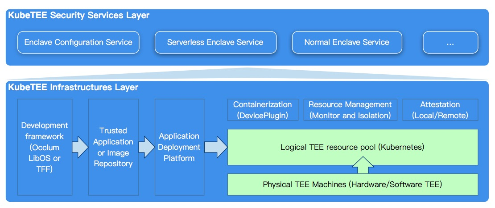

# KubeTEE

Use of TEE in a cloud-native way.

## Introduction to KubeTEE
KubeTEE is a collection of TEE development, deployment, maintenance middleware frameworks,
and services. Especially, it is for cloud-native workflows.
As the name implies, KubeTEE is based on the docker containers, Kubernetes orchestration,
and other cloud-native technologies. Its goal is to help developers to implement TEE-based
applications and deploy TEE services more easily and smoothly.

KubeTEE is currently mainly based on Intel (R) Software Guard Extensions (Intel (R) SGX).
SGX is a CPU-based hardware security technology provided by Intel. It uses encrypted memory
to protect runtime code and data from being stolen and Malicious tampering.

## KubeTEE Components/Services List

- [sgx-device-plugin](https://github.com/AliyunContainerService/sgx-device-plugin) is a daemonset to inject the SGX device into container and to manage the SGX EPC resource.
- [trusted-function-framework](https://github.com/SOFAEnclave/trusted-function-framework) is SGX partition model application programming framework.
- [enclave-configuration-service](https://github.com/SOFAEnclave/enclave-configuration-service) is a remote attestation based enclave configuration service.
- [protobuf-sgx](https://github.com/SOFAEnclave/protobuf-sgx) is protobuf-cpp with SGX modifications which can be used in enclave.

If you want to contribute, please go directly to the project you are interested in.

## Report issues

If you find any source code bug, please create a issue in the repository directly.
For any other problems or security vulnerabilities, you can also contact us by [email](mailto:SOFAEnclaveSecurity@list.alibaba-inc.com).

